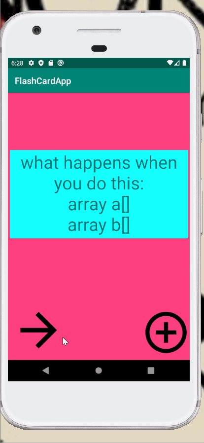

# Flashcard-4
### App Description
Lab four of the flashcard app for codepath
These are the features of the app I have completed
### App Walk-though
 
### Required User Stories
- [X] Start by opening Android Studio and running your app to make sure everything still works as expected
- [X] Add a launcher icon for your app!
- [X]Add a transition animation when the app goes from MainActivity to AddCardActivity
- [X] Add an animation for when the answer is revealed.
- [X] Add a sliding animation for when the user advances to the next card.
- [X] Add some last touches!
###  Optional User Stories
- [X]  Styling views
- []  Add a countdown timer for each question
- [] (Advanced Optional) Replace the answer 'reveal' animation with a 'card flip' animation
- [] Add a celebration animation if the user answers the question correctly.
